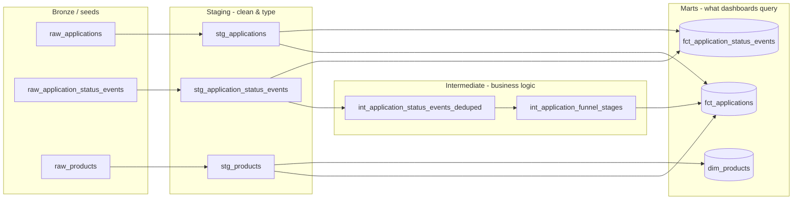
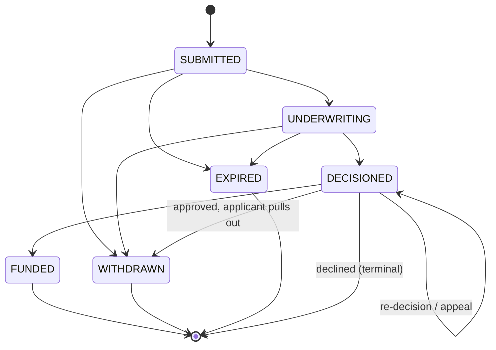

# Credit Applications dbt Model

A dbt data model for credit applications, to be used fo
funnel/conversion/cycle-time reporting and ad-hoc analysis. Includes assumptions callout the prompt asked for.

## TL;DR

- **Grain of the mart:** one row per `application_id` in `fct_applications`.
- **Funnel modeled:** `SUBMITTED -> UNDERWRITING -> DECISIONED -> FUNDED`, with
  `WITHDRAWN` / `EXPIRED` as exits that can happen at most points.
- **Core design choice:** applications are modeled as an **event log**
  (one row per status change), not a single mutable status column. The mart
  is a pivot over that log. This is the main lever behind both the
  "extensible" and "resilient" asks in the prompt - see below.

## Architecture



## The funnel, as modeled



## Project layout

```
seeds/        raw_applications, raw_application_status_events, raw_products
models/
  staging/      1:1 typed pass over each seed/source, no business logic
  intermediate/ dedup (ephemeral) + pivot/funnel stages (table)
  marts/        fct_applications, fct_application_status_events, dim_products
tests/         singular tests (cross-table / cross-row checks)
macros/        reusable generic test: no_volume_anomaly
queries/       5 example analyses against the mart
```

## Why an event log instead of a status column

This is the central design decision, so it's worth spelling out.

**Extensible.** Adding a new funnel stage (say, `OFFER_PRESENTED` between
`UNDERWRITING` and `DECISIONED`) means: add the value to one
`accepted_values` test, add one `max(case when status = '...')` line to
`int_application_funnel_stages.sql`. No migration, no backfill of a status
column, no touching `fct_applications`'s grain. Adding a second product
(e.g. `hardship_loan`, already seeded as an inactive row in `raw_products` to
prove this out) needs **zero** model changes - it's a data change. Product-
specific attributes that don't deserve their own column live in
`stg_applications.attributes_json`, a free-form JSON field, rather than
forcing every product's fields into the shared table up front.

**Resilient.** A single mutable `status` column on the application record
is one bad UPDATE away from losing history - you can't tell whether an
application sat in underwriting for 10 minutes or 10 days. The event log
keeps every state transition, so reprocessing/replays are idempotent
(dedup logic lives in `int_application_status_events_deduped`, keyed off
the data itself rather than load order) and "what actually happened to
application X" is always answerable from `fct_application_status_events`,
even after the mart has rolled forward. Out-of-order or duplicate events
from upstream retries (see `APP-0014` in the seeds) don't corrupt the
funnel - they just get deduped deterministically.

## Assumptions

- **Funnel stages:** `SUBMITTED -> UNDERWRITING -> DECISIONED -> FUNDED`,
  confirmed in scoping. `WITHDRAWN`/`EXPIRED` are modeled as exits, not
  funnel stages.
- **Single product today, multi-product-ready:** seeds model one active
  product (`personal_loan`) plus one inactive future product (`hardship_loan`)
  to prove the dimension already supports more without schema changes.
- **Re-Review:** an application can receive more than one
  `DECISIONED` event (e.g. declined, then approved on appeal -
  `APP-0015`). The **latest** decision is treated as authoritative for
  `final_decision_outcome`; the **first** `DECISIONED` event's timestamp is
  kept separately (`first_decisioned_at`) for "time to first decision"
  reporting, since those answer different questions.
- **Duplicate non-decision events are noise, not business events.** Two
  `UNDERWRITING` events two minutes apart is treated as a retry; the first
  occurrence marks stage entry. This is a judgment call - flagged via
  `occurrence_count` in `int_application_status_events_deduped` if anyone
  wants to audit it.
- **In production, staging would select from `source()`, not `ref()`** -
  the prompt said not to model ingestion, so staging reads seeds directly.
  Swapping in a real `sources.yml` is a one-line change per model.
- **`stale_application_days` (var, default 14)** is a placeholder
  threshold for flagging stuck in-progress applications
- **Interval syntax in `fct_applications.sql`** (`interval '... days'`) is
  DuckDB/Postgres-style. Swap for `DATEADD`/equivalent if porting to
  Snowflake/BigQuery - everything else uses `dbt.datediff` (the built-in
  cross-db macro).

## Tests & anomaly detection

Three layers, separated by severity:

1. **Structural (error severity):** not-null/unique/accepted_values/
   relationships on every key column, plus business-rule checks that
   should never be false regardless of timing - e.g. a funded application
   can't also be declined (`_marts.yml`), every decline needs a reason
   code (`tests/assert_declines_have_reason_code.sql`).
2. **Sequencing / data-quality (warn severity)**
   stage timestamps should move forward in time.
   `APP-0018` deliberately has a `FUNDED` event logged 3 hours *before*
   its `DECISIONED` event (simulated clock skew between systems) to
   demonstrate this firing without failing the build. Same idea for
   `tests/assert_created_at_matches_first_submitted_event.sql`
   (`APP-0017`).
3. **Anomaly detection (warn severity, production-shaped):**
   `macros/test_no_volume_anomaly.sql` is a reusable generic test - flags
   any day whose row volume deviates from a trailing rolling
   average/stddev by more than N standard deviations, rather than a
   hardcoded row-count threshold. Honestly: with ~3 weeks of seed data it
   won't have enough history to fire meaningfully. It's written the way
   it should run in production (wired onto `fct_applications.submitted_at`
   in `_marts.yml`), not gamed to trigger on this seed set.

Run `dbt test` and expect: all `error`-severity tests pass, and **2
`warn`s** from the seeded edge cases above (this is intentional, not a
bug in the seed data).

## How to run

### Prerequisites

This project runs with **dbt-fusion** (the Rust-based dbt engine, ships with
the VS Code dbt extension and the dbt CLI `~/.local/bin/dbt`). Standard
`dbt-core` + `dbt-duckdb` also works if you prefer:

```bash
pip install dbt-core dbt-duckdb   # standard dbt-core path (optional)
```

### Setup

`profiles.yml` is checked in and ready to use. It points to `cli.duckdb`
rather than `dev.duckdb` to avoid a lock conflict: the VS Code dbt extension
holds an exclusive write lock on `dev.duckdb` while VS Code is open, so CLI
commands need a separate file.

```bash
dbt deps   # install dbt_utils package
dbt seed   # load seed CSVs into DuckDB (creates cli.duckdb on first run)
```

### Running the models

**First run** (builds everything from scratch):

```bash
dbt build
```

**Subsequent runs** (incremental — only reprocesses applications with recent
event activity, default lookback window is 3 days):

```bash
dbt run   # fct_applications runs incrementally; other models are table/view
```

**Force a full refresh** (reprocesses all rows, use after schema changes or
to rebuild from scratch):

```bash
dbt run --full-refresh
```

**Override the incremental lookback window** (e.g. widen to 7 days if your
upstream has longer delivery delays):

```bash
dbt run --vars '{"incremental_lookback_days": 7}'
```

### Running tests

```bash
dbt test
```

Expected result: all `error`-severity tests pass, **2 `warn`s** from
deliberately seeded edge cases (APP-0018 clock-skew, APP-0017 created_at lag)


### Exploring results

After `dbt run`, query the mart tables directly in DuckDB:

```bash
dbt show --select fct_applications   # preview rows in the terminal
```

`queries/*.sql` are dbt analyses — self-contained queries against
`fct_applications` / `fct_application_status_events` (cycle time, funnel
conversion, decline reasons, etc). Run one straight from the terminal with
`dbt show`, same as a model, using `--target cli` to hit `cli.duckdb`:

```bash
dbt show --select cycle_time_by_channel --target cli
```

Swap in any file name under `queries/` (minus the `.sql`). To get the raw SQL
instead of executed results — e.g. to paste into another client — use
`dbt compile --select <analysis_name>` and read the compiled output from
`target/compiled/`.

## Getting closer to real-time

The current setup is batch: dbt runs on a schedule, the mart reflects
whatever events had arrived as of the last run. For most funnel dashboards
that's fine — a 15-minute-old conversion rate doesn't change a decision. But
if you need something fresher (ops queues, same-day funding targets, live
application counts), here's how I'd approach it in order of increasing
complexity.

**Shorten the dbt run cadence.** The incremental setup on `fct_applications`
already exists for this — just run it every 5–15 minutes instead of hourly.
`incremental_lookback_days` can be set to a fractional value or swapped for
an hourly window. This gets you to single-digit-minute lag with no
architectural changes; it's usually enough for a dashboard.

**Stream events directly to the raw table.** The event log design maps
cleanly onto a streaming write pattern: as each status change fires in the
application system, append a row to `raw_application_status_events` via
Pub/Sub → BigQuery streaming inserts (or a Firehose equivalent). The dbt
models don't need to change — `int_application_status_events_deduped`
already handles late-arriving and duplicate events regardless of how the
rows got there. Pair this with a 5-minute dbt run and you're typically
within one run cycle of real-time.

**True sub-minute latency.** If you actually need near-instant numbers on a
dashboard — dbt isn't the right tool for the final hop. The usual pattern is: stream events
through Kafka or Pub/Sub into a stream processor (eg. Flink) that maintains running aggregates directly in memory/redis. The dbt models still exist as the authoritative historical layer; the stream
processor handles the live view.
